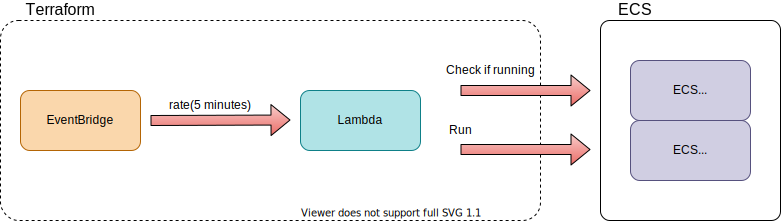

# scheduled-lambda-ecs

A Terraform module that creates a scheduled Lambda function to run an ECS task if that task is not already running.

Resources created:
*  EventBridge Rule
*  Lambda Function
*  Corresponding IAM roles/policis
*  Corresponding CloudWatch Logs 

## Example Usage
```hcl
module "scheduled-lambda-function" {
    source = "git@github.com:tim-morgan/terraform-aws-scheduled-lambda-ecs"

    lambda_name             = "scheduled-run-ecs"
    lambda_description      = "Lambda to run an ECS task."
    environment             = "dev"

    service                 = "Lambda demo"
    project                 = "demo"
    contact                 = "myemail@example.com"

    schedule_expression     = "rate(30 minutes)"

    # Required from ECS deployment to set lambda permissions to run the task
    ecs_task_definition_family  = aws_ecs_task_definition.example_task.family
    ecs_task_execution_role_arn = aws_iam_role.ecs_task_execution_role.arn
}
```


## Diagram Overview

